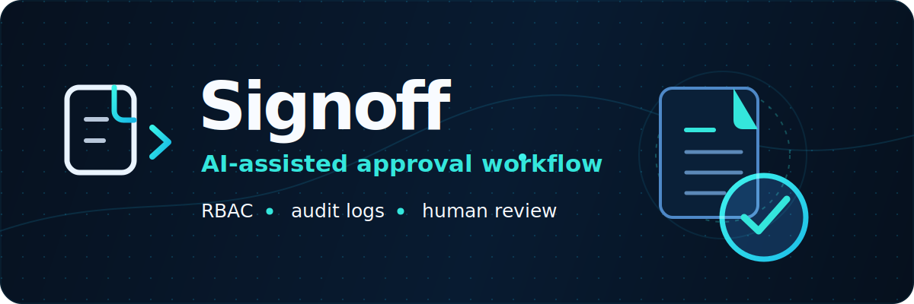

<div align="center">



**Procurement approval app for request intake, approval routing, AI risk checks, and audit trails.**

Signoff lets employees submit purchase requests, routes each request to the right reviewers, flags risk with AI, and records every decision.

It is designed for teams that need a clearer way to review spending requests without losing decisions in email threads or spreadsheets.

[](https://github.com/berna-ahito/signoff)
[](https://github.com/berna-ahito/signoff)
[](https://github.com/berna-ahito/signoff)
[](LICENSE)

</div>

---

## The problem this solves

Procurement requests often start in email, chat, or spreadsheets. That makes approvals, reviewer responsibility, and decision history hard to track.

Signoff keeps the request, approval path, AI review, and audit history in one place.

---

## Features

| Feature | What it does |
|---|---|
| Request intake | Employees submit purchase requests with category, urgency, amount, vendor details, and attachments. |
| Approval routing | Requests move through manager and finance review based on amount and category rules. |
| AI-assisted review | AI flags risk or missing information, but does not approve or reject requests. |
| Audit trail | Status changes, reviewers, notes, and timestamps are recorded for review. |
| Role-based access | Requesters, managers, finance users, and admins see different actions and data. |
| Dashboard | Shows request volume, approval status, spend by category, and recent activity. |
| Notifications | Sends submission and decision updates when email is configured. Logs locally when email is not configured. |

---

## Stack

| Layer | Technology |
|---|---|
| Backend | FastAPI · SQLAlchemy · Alembic |
| Database | PostgreSQL via Neon (SQLite in dev) |
| Frontend | React 18 · Vite · TypeScript |
| UI | shadcn/ui · Tailwind CSS · Motion |
| Charts | Recharts |
| AI | Groq API (MockProvider default, no key needed) |
| Tests | pytest · 170 passing · 95% coverage · Vitest · 38 passing |
| Deploy | Render (single web service) · Neon (database) |

---

## Try the demo

Live demo: https://signoff-4gbs.onrender.com

The demo includes seeded purchase requests so reviewers can see the dashboard, request list, role-based approval flow, and audit log immediately. The data is fake and uses realistic purchase amounts.

| Email | Password | Role |
|---|---|---|
| alice@test.com | alice123 | Requester |
| bob@test.com | bob123 | Manager |
| carol@test.com | carol123 | Finance |
| admin@test.com | admin123 | Admin |

Suggested demo path:

1. Log in as Alice to submit a purchase request.

2. Log in as Bob or Carol to review routed requests.

3. Log in as Admin to inspect users, approval rules, and the audit log.

---

## Quick start

**Prerequisites:** Python 3.11+, Node.js 20+

~~~bash
# Backend
py -m pip install -r requirements.txt
cp .env.example .env          # set SECRET_KEY at minimum
py -m alembic upgrade head
py scripts/seed.py            # loads demo data
py -m uvicorn app.main:app --reload
~~~

~~~bash
# Frontend (separate terminal)
cd frontend
npm install
npm run dev
~~~

Open `http://localhost:5173`. Demo credentials are listed in Try the demo above.

---

## Security

- **IDOR/BOLA:** every resource goes through `_get_request_or_403`. Ownership is checked per request.
- **No mass assignment:** separate `Create`, `Update`, and `AdminUpdate` schemas. Users cannot change their own role.
- **Refresh tokens:** stored server-side and revoked on logout. Rotation on refresh is not implemented in this version.
- **AI output validation:** `risk_level` and `recommended_action` validated against an allowlist before persist.
- **File uploads:** 5 MB cap enforced before reading into memory, count limited to 5. Safe `Content-Disposition` headers on download.
- **Rate limiting:** SlowAPI on all mutation and read endpoints. 5/min on login.
- **Security headers:** `X-Frame-Options`, `X-Content-Type-Options`, `Referrer-Policy` on every response.
- **No docs in production:** `/docs`, `/redoc`, `/openapi.json` disabled when `APP_ENV=production`.
- **Authentication:** all endpoints except `/health` require authentication. Admin-only routes enforce `require_role("admin")`.

---

## Deploy

Live demo: https://signoff-4gbs.onrender.com

Signoff is deployed as one Render web service. The backend serves the built frontend.

Required Render environment variables:

| Variable       | Purpose                                                |
| -------------- | ------------------------------------------------------ |
| `DATABASE_URL` | PostgreSQL connection string                           |
| `SECRET_KEY`   | JWT signing secret                                     |
| `APP_ENV`      | Set to `production`                                    |
| `CORS_ORIGINS` | Public app origin after Render creates the service URL |

Optional Render environment variables:

| Variable                      | Purpose                                 |
| ----------------------------- | --------------------------------------- |
| `GROQ_API_KEY`                | Enables live AI review provider         |
| `RESEND_API_KEY`              | Enables email notifications             |
| `RUN_SEED_ON_START`           | Seeds demo data on startup when enabled |
| `ACCESS_TOKEN_EXPIRE_MINUTES` | Access token lifetime                   |
| `REFRESH_TOKEN_EXPIRE_DAYS`   | Refresh token lifetime                  |

Do not commit secret values.

---

## Tests

```bash
# Backend (170 passing, 95% coverage)
py -m pytest --cov=app --cov-report=term-missing

# Frontend (38 passing)
cd frontend && npm test -- --run
```

Coverage target: ≥ 94% backend, all frontend test suites green.

## Project structure

```
signoff/
├── app/
│   ├── core/          # auth, deps, rate limiter, security
│   ├── db/            # SQLAlchemy models and session
│   ├── routers/       # FastAPI routers per domain
│   ├── schemas/       # Pydantic request/response models
│   └── services/      # AI review, approval engine, notifications
├── tests/             # pytest test suite
├── frontend/
│   ├── src/
│   │   ├── api/       # axios client + per-domain helpers
│   │   ├── components/# shared UI components
│   │   ├── pages/     # route-level page components
│   │   ├── lib/       # authStore, hooks
│   │   └── __tests__/ # Vitest unit tests
├── render.yaml
└── .env.example
```

## License

MIT. See [LICENSE](LICENSE).
