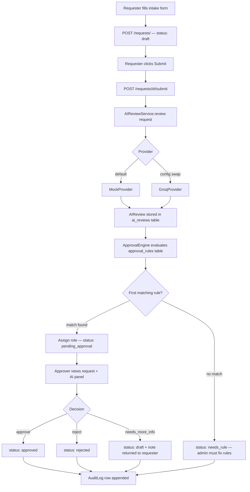

# Architecture

## Request Lifecycle



> **Note:** The AI's `recommended_action` is advisory text stored in the `ai_reviews` table. The human decision is recorded separately in the `AuditLog` and drives the actual status transition.

---

## Key Design Decisions

### Human-in-the-Loop AI

AI may classify requests, detect missing information, assess risk, and draft RFQ text. AI may **not** approve or reject spending. The `recommended_action` field is advisory; the approver's decision is the authoritative action. This design prevents liability and maintains human accountability for financial commitments.

### Provider-Agnostic AI Layer

`AIReviewProvider` is an abstract base class. `MockProvider` is the default — deterministic, free, and zero-latency. `GroqProvider` is available and activated by setting `AI_PROVIDER=groq` in `.env`. Swapping providers requires zero changes to business logic.

### Configurable Approval Rules Engine

Approval routing is driven by an `approval_rules` table evaluated at submit time. Each rule has `min_amount`, `max_amount`, `category` (nullable = wildcard), `required_role`, and `priority`. The first matching rule in priority order wins. This avoids hardcoded thresholds, makes rules auditable, and lets admins change policy without a code deploy.

### IDOR/BOLA Protection

Every request-scoped endpoint calls `_get_request_or_403(request_id, current_user, db)`. This helper fetches the request and raises HTTP 403 if the current user is not the owner and does not hold the `admin` role. Admins bypass ownership for operational oversight.

---

## Directory Structure

```
procureflow-ai/
├── app/
│   ├── main.py               # FastAPI app + router mounts
│   ├── models.py             # SQLAlchemy ORM models
│   ├── schemas.py            # Pydantic request/response schemas
│   ├── database.py           # SQLAlchemy engine + session
│   ├── auth.py               # JWT creation + verification
│   ├── dependencies.py       # Shared FastAPI dependencies (current_user, etc.)
│   ├── routers/              # Route handlers (auth, requests, approvals, audit, users, ai_reviews)
│   └── services/             # Business logic (approval_engine, audit_service, ai_review, ai_providers)
├── frontend/
│   └── src/
│       ├── api/              # Axios wrappers per domain (auth, requests, approvals, audit, users)
│       ├── components/       # Shared UI components (StatusBadge, AIReviewPanel, ApprovalActions, NavBar)
│       ├── hooks/            # Custom hooks (useAuth)
│       ├── pages/            # Route-level page components
│       └── __tests__/        # Vitest test files (6 files, 14 tests)
├── tests/                    # pytest test suite (backend)
├── alembic/                  # Database migration scripts
├── docs/                     # Architecture, spec, security checklist, data model, case study
└── scripts/                  # Seed script for demo users
```

---

## Data Model

| Table | Primary Key | Notable Fields |
|-------|-------------|----------------|
| `users` | `id` | `email`, `role` (requester/manager/finance/admin), `hashed_password`, `is_active` |
| `purchase_requests` | `id` | `status`, `requester_id` (FK), `assigned_role`, `estimated_cost`, `category`, `urgency` |
| `approval_rules` | `id` | `priority`, `min_amount`, `max_amount`, `category` (nullable), `required_role` |
| `audit_logs` | `id` | `request_id` (FK), `actor_id` (FK), `action`, `old_status`, `new_status`, `note` |
| `ai_reviews` | `id` | `request_id` (FK), `summary`, `risk_level`, `recommended_action`, `rfq_draft`, `confidence` |
